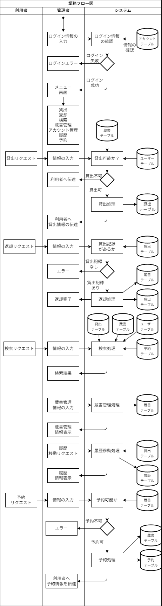

# 仕様書
## 業務要件
### 業務フロー図

## システム方式設計
### ハードウェア方式
#### サーバー環境
- サーバー種別: オンプレミス
- Webサーバー: Tomcat
- DBサーバー: MySQL
#### クライアント環境
- ブラウザ: Google Chrome最新版
### ソフトウェア方式
#### フロントエンド
- 言語: HTML, CSS, Javascript
- テンプレートエンジン: Thymeleaf
#### バックエンド
- 言語: Java
- フレームワーク: Spring
## 画面設計
### 画面一覧
- ログイン画面
- メニュー画面
- 貸出画面
- 返却画面
- 検索画面
    - 検索結果画面
- 蔵書画面
- 履歴画面
- 予約画面
- アカウント管理画面
### 画面遷移図

## バッチ処理
### 履歴移動処理
- タイミング: 月次
- 手動で貸出テーブルの返却済み記録を履歴テーブルに移動
## テーブル設計
### テーブル一覧
#### **Books**
| カラム名       | 型      | 制約            |
| -------------- | ------- | --------------- |
| BookId         | INT     | PRIMARY KEY     |
| Title          | VARCHAR | NOT NULL        |
| TitleKana      | VARCHAR | NOT NULL        |
| AuthorName     | VARCHAR | NOT NULL        |
| AuthorNameKana | VARCHAR | NOT NULL        |
| PublisherId    | INT     | FOREIGN KEY     |
| PublishDate    | DATE    | NOT NULL        |
| ISBN           | VARCHAR | UNIQUE, NOTNULL |
| NDC            | VARCHAR | NOT NULL        |
| IsAvailable    | BOOLEAN | DEFAULT TRUE    |

#### **Publishers**
| カラム名      | 型      | 制約        |
| ------------- | ------- | ----------- |
| PublisherId   | INT     | PRIMARY KEY |
| PublisherName | VARCHAR | NOT NULL    |

#### **Loans**
| カラム名   | 型       | 制約        |
| ---------- | -------- | ----------- |
| LoanId     | INT      | PRIMARY KEY |
| BookId     | INT      | FOREIGN KEY |
| UserId     | INT      | FOREIGN KEY |
| LoanDate   | DATETIME | NOT NULL    |
| ReturnDue  | DATETIME | NOT NULL    |
| ReturnDate | DATETIME | NULLABLE    |

#### **Users**
| カラム名      | 型      | 制約         |
| ------------- | ------- | ------------ |
| UserId        | INT     | PRIMARY KEY  |
| FirstName     | VARCHAR | NOT NULL     |
| FirstNameKana | VARCHAR | NOT NULL     |
| LastName      | VARCHAR | NOT NULL     |
| LastNameKana  | VARCHAR | NOT NULL     |
| Grades        | INT     | FOREIGN KEY  |
| Class         | INT     | NOT NULL     |
| ClassNum      | INT     | NOT NULL     |
| Gender        | INT     | NOT NULL     |
| IsAvailable   | BOOLEAN | DEFAULT TRUE |

#### **Grades**
| カラム名 | 型      | 制約        |
| -------- | ------- | ----------- |
| GradesID | INT     | PRIMARY KEY |
| Grade    | VARCHAR | NOT NULL    |

#### **Staffs**
| カラム名      | 型      | 制約             |
| ------------- | ------- | ---------------- |
| StafftId     | INT     | PRIMARY KEY      |
| UserName      | VARCHAR | UNIQUE, NOT NULL |
| Password      | VARCHAR | NOT NULL         |
| FirstName     | VARCHAR | NOT NULL         |
| FirstNameKana | VARCHAR | NOT NULL         |
| LastName      | VARCHAR | NOT NULL         |
| LastNameKana  | VARCHAR | NOT NULL         |
| IsEnable      | BOOLEAN | DEFAULT TRUE     |

#### **History**
| カラム名   | 型       | 制約        |
| ---------- | -------- | ----------- |
| HistoryId  | INT      | PRIMARY KEY |
| BookId     | INT      | FOREIGN KEY |
| UserId     | INT      | FOREIGN KEY |
| LoanDate   | DATETIME | NOT NULL    |
| ReturnDue  | DATETIME | NOT NULL    |
| ReturnDate | DATETIME | NULLABLE    |

#### **Logs**
| カラム名        | 型       | 制約        |
| --------------- | -------- | ----------- |
| LogId           | INT      | PRIMARY KEY |
| AccountId       | INT      | FOREIGN KEY |
| UserId          | INT      | FOREIGN KEY |
| OperationTypeId | INT      | FOREIGN KEY |
| OperationTime   | DATETIME | NOT NULL    |
| TableName       | VARCHAR  | NOT NULL    |
| RecordId        | INT      | NOT NULL    |
| Status          | VARCHAR  | NOT NULL    |

#### **OperationTypes**
| カラム名      | 型      | 制約        |
| ------------- | ------- | ----------- |
| Operation型Id | INT     | PRIMARY KEY |
| Operation型   | VARCHAR | NOT NULL    |

#### **Reservations**
| カラム名        | 型       | 制約          |
| --------------- | -------- | ------------- |
| ReservationId   | INT      | PRIMARY KEY   |
| BookId          | INT      | FOREIGN KEY   |
| UserId          | INT      | FOREIGN KEY   |
| ReservationDate | DATETIME | NOT NULL      |
| IsLoaned        | BOOLEAN  | DEFAULT FALSE |

### ER図

