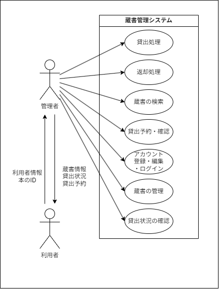

# 要件定義書
## 1. システム概要
### 1-1. 概要説明
図書館向けの蔵書管理システムです。

本システムは以下の主な機能を提供します:
- 蔵書/利用者の検索機能
- ログイン・アカウント作成機能
- 本の貸出機能
- 本の貸出予約機能
- 管理者による本の返却機能
- 本の貸し出し状況確認機能

### 1-2. 目的
本システムにより、
- **蔵書管理の簡略化**: 図書館運営の負担を軽減。
- **利用者の利便性向上**: 蔵書検索機能により、スムーズな利用を実現。
- **管理者の業務効率化**: 貸出状況の確認機能で運営業務をサポート。

これらを実現する事を目的としています。

### 1-3. 背景
現状、図書館の蔵書や貸出状況は紙台帳やExcelを用いた手動入力によって管理されています。

現状の課題:
- **入力ミスの発生**: 手動入力のため、貸出・返却情報の誤記や記入漏れが起きる可能性が高い。
- **情報の検索性の低さ**: Excelでの情報検索に時間がかかり、利用者対応に支障をきたす場合がある。
- **複数人での運用が困難**: 同時編集が難しく、複数人での管理業務に対応しづらい。
- **データの一元管理が不十分**: 貸出・返却履歴が十分に統合されておらず、長期的なデータ分析が難しい。
- **セキュリティの脆弱性**: Excelファイルはパスワード保護などの簡易的な対策しか行えず、データ漏洩リスクがある。
- **利用者への対応の非効率性**: リアルタイムでの貸出状況確認や予約システムがなく、利用者に迅速な対応ができない。

### 1-4. 想定利用者
- 利用者: 図書館で本の貸し借りを行う利用者。
- 管理者: 図書館で管理業務を行う担当者。

本システムは、図書館管理者が操作を行い、利用者（生徒や教職員）は貸出・返却の際に管理者を通じて間接的に利用することを想定しています。
### 1-5. 開発範囲
### 2. 業務要件
#### 2-1. 業務要件一覧
| No. | 業務内容                       | 説明                                                                 | 実施者 |
| :-- | :----------------------------- | :------------------------------------------------------------------- | :----: |
| 1   | 蔵書の返却                     | 蔵書の返却業務                                                       | 管理者 |
| 2   | 蔵書の貸出                     | 本の貸出                                                             | 管理者 |
| 3   | 蔵書の検索                     | 蔵書の確認、予約の確認                                               | 管理者 |
| 4   | 貸出予約                       | 蔵書の貸出予約                                                       | 管理者 |
| 5   | 貸出状況の確認                 | 本の貸出状況の確認、貸出予約の確認、返却期限を過ぎた本の利用者の確認 | 管理者 |
| 6   | アカウントの作成               | システムへのアカウント登録                                           | 管理者 |
| 7   | アカウントログイン、ログアウト | システムへのアカウントログイン、ログアウト                           | 管理者 |
| 8   | 蔵書の管理                     | システムへの蔵書の登録・編集                                         | 管理者 |
#### 2-2. 規模
- **対象蔵書数**: 最大10,000冊の登録が可能。
- **利用者数**: 最大2,000人の利用者アカウントを登録可能。
- **管理者数**: 最大1人の管理者アカウントを登録可能。
- **貸出履歴保存期間**: 貸出・返却履歴を最長10年間保存。
- **月間貸出件数**: 平均3,000件程度の貸出に対応。
- **蔵書検索速度**: 平均100ms以内で検索結果を表示。
#### 2-3. 時期・時間
- **利用可能時間**: 
  - システム稼働時間は年中無休で24時間対応。
  - メンテナンス時間帯(不定期)を除く。

- **業務時間**:
  - 図書館の営業時間に基づき、貸出および返却業務は以下の時間で対応。
    - 平日: 午前9時～午後6時
    - 土日祝日: なし
  - 管理者による運用業務（返却期限超過者対応など）は営業時間内に実施。

- **システム開発期間**:
  - 開発完了: 2024年1月1日

- **履歴保存期間**:
  - 貸出履歴・返却履歴: 10年間保存。
  - 利用者アカウント情報: アカウント削除後3年間保持。

- **貸出期間**
  - 1週間
  - 返却期限を過ぎた場合は延滞として記録
##### 2-3-1. 利用時間可能時間
- システム稼働時間は年中無休で24時間対応。
- メンテナンス時間帯(不定期)を除く。
##### 2-3-2. 業務時間
- 図書館の営業時間に基づき、貸出および返却業務は以下の時間で対応。
  - 平日: 午前9時～午後6時
  - 土日祝日: なし
- 管理者による運用業務（返却期限超過者対応など）は営業時間内に実施。
#### 2-4. システム化の範囲
##### システム化対象業務
1. **貸出業務**  
   - 管理者がログイン後、蔵書を指定し、貸出を記録する処理。
   - 貸出状況の更新および履歴の記録。

2. **返却業務**  
   - 管理者がログイン後、蔵書を指定し、返却を記録する処理。
   - 貸出状況を更新および履歴を記録。

3. **蔵書検索業務**  
   - 利用者および管理者が、蔵書情報（タイトル、著者、貸出状況など）を検索。

4. **貸出状況確認業務**  
   - 管理者が、現在の貸出状況を確認。
   - 貸出期限を過ぎた利用者リストの作成・参照。

5. **アカウント管理業務**  
   - 管理者のアカウント作成、ログイン、ログアウトの管理。

6. **貸出予約業務**
   - 管理者がログイン後、蔵書を指定し、貸出予約を記録する処理。
   - 貸出状況の更新および履歴の記録。

### システム化対象外業務
1. **利用者への直接連絡業務**  
   - 返却期限超過時の電話・メール連絡はシステムの対象外。手動対応。

2. **予算管理業務**  
   - 図書購入や運営予算管理はシステムの対象外。

3. **データ移行**
   - 旧システムからのデータ移行はシステムの対象外。
4. **帳票印刷**
   - 帳票データの印刷等の出力はシステムの対象外。
5. **環境構築**
   - 動作環境の構築やサーバーの構築は対象外。
### システム化の範囲図（DFD）
#### DFD レベル0

### ユースケース図

## 3. 機能要件
### 3-1. 必要機能要件
#### 3-1-1. 必要機能要件一覧
| No  | 機能名           | 説明                                 | 優先度 |
| --- | ---------------- | ------------------------------------ | ------ |
| 1   | 貸出機能         | 本の貸出管理                         | 高     |
| 2   | 返却機能         | 本の返却管理                         | 高     |
| 3   | 検索機能         | 蔵書/利用者の検索                    | 高     |
| 4   | アカウント機能   | 管理者のアカウント作成/編集/ログイン | 高     |
| 5   | 貸出状況確認機能 | 蔵書の貸出状況の確認                 | 中     |
### 3-2. 希望機能要件
#### 3-2-1. 希望機能要件一覧
| No  | 機能名       | 説明                                            | 優先度 |
| --- | ------------ | ----------------------------------------------- | ------ |
| 1   | 蔵書管理機能 | システムへの本の登録・編集                      | 中     |
| 2   | 貸出予約機能 | 蔵書の貸出の予約                                | 低     |
| 3   | 貸出履歴機能 | 貸出/返却の履歴を一定期間後別テーブルへ移し確認 | 中     |
| 4   | ログ機能     | システムの操作ログを記録                        | 低     |
## 4. 非機能要件
### 4-1. 非機能要件一覧
| No  | 項目             | 定義なし |
| --- | ---------------- | -------- |
| 1   | 可用性           | ◯        |
| 2   | 性能・拡張性     |          |
| 3   | 運用・保守性     |          |
| 4   | 移行性           | ◯        |
| 5   | セキュリティ     |          |
| 6   | 環境・エコロジー | ◯        |
### 4-2. 可用性
可用性については利用者数が少ない見込みの為、定義しないものとする。
### 4-3. 性能・拡張性
| 項目               | 内容                                                            |
| ------------------ | --------------------------------------------------------------- |
| 蔵書検索速度       | ユーザーが検索を実行した際、平均100ms以内に結果を表示すること。 |
| 登録可能な蔵書数   | 最大10,000冊までの蔵書データを登録可能であること。              |
| 登録可能な利用者数 | 最大2,000人までの利用者アカウントを登録可能であること。         |
| 登録可能な管理者数 | 最大1人の管理者アカウントを登録可能であること。                 |
| 貸出履歴の保存期間 | 貸出および返却履歴を最長10年間保持可能であること。              |
| 月間対応貸出件数   | 平均3,000件程度の貸出に対応すること。                           |
| 利用可能時間       | メンテナンス時間(不定期)を除いて24時間365日稼働                 |
### 4-4. 運用・保守性
#### 運用
- ログ機能

   貸出記録は最低一週間保持し、古いデータは別のテーブルに移動しアーカイブ化する。
#### 保守性
- MVCアーキテクチャを用いてコードの保守性を高めること。
### 4-5. 移行性
移行性については、スクラッチ開発のため定義しないものとする。
### 4-6. セキュリティ
1. パスワードのハッシュ化
   - アカウントに使用されるパスワードはハッシュ化して保存する。
2. Spring Securityの使用について
   - Spring Securityの最新構文を使用する。
3. 操作ログの記録
   - システムの操作ログを記録する(希望機能)
4. 攻撃対策
   - SQLインジェクション対策: 静的プレースホルダーを使用し対策。
   - XSS対策: Thymeleafによりエスケープ処理を施す。
### 4-7. 環境・エコロジー
環境・エコロジーについては、小規模システムの為定義しないものとする。
## 5. 制約条件
### 5-1. 技術的制約
以下の技術を使用して開発するものとする。

- 使用言語: Java
- フレームワーク: Spring
- テンプレートエンジン: Thymeleaf
- Webサーバー: Tomcat
- データベース: MySQL
- 開発環境:　Eclipse IDE(Mavenビルド), Visual Studio Code
- バージョン/コード管理: Git/Github
- 認証/認可: Spring Security

サーバーに関してはすべてオンプレミスでの構築とする。
### 5-2. リソース制約
1. 開発人員
- 設計/開発: 1名
2. 開発工数
- 2人月
3. 予算
- ~~150万~300万らしい~~　☆プライスレス☆
### 5-3. スケジュール制約
開発期間は 2024/11/11~2025/1/1完成を目標とする。